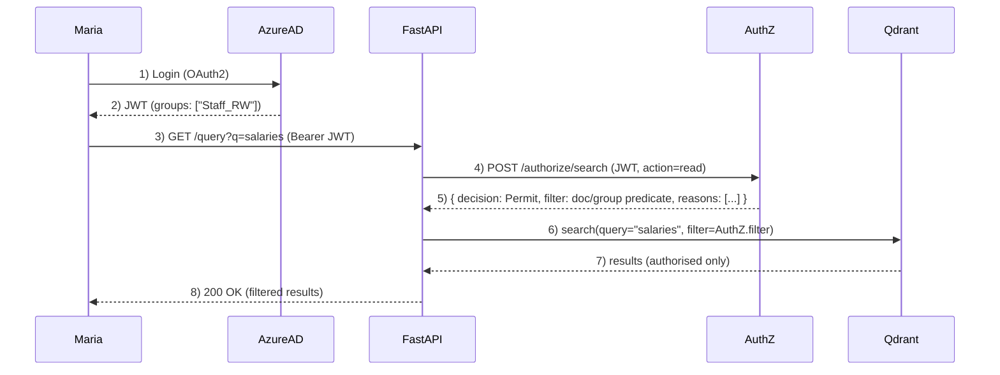

# Homelab Retrieval-Augmented Generation (RAG)

A Retrieval-Augmented Generation (RAG) system designed to ingest, embed, and query around 100,000 artificial intelligence research papers.

👉 **Note**: This repo is a **shop window**.  
The actual working codebase is private, as this is first and foremost a *learning tool*.  
When components are production-ready, they’ll be released here or as separate open-source modules.

Retrieval-Augmented Generation (RAG) systems ground a large language model's responses in a specific, authoritative knowledge base. This system has consumed over 100,000 AI research papers. Each paper is broken into smaller sections ("chunks") and each of these is processed into an embedding, a mathematical representation that makes it possible to compare concepts and ideas rather than just matching keywords.

When a question is asked, it too is converted into embeddings. The system matches these embeddings against the stored research and provides the results to the language model. The model then uses the retrieved content, along with style and instruction prompts, to generate a natural-language answer that stays grounded in the source material.

## Project goals
1. Hands-on learning: Build a non-trivial Linux software project, gaining practical experience with Python, Bash, GitHub, monitoring, and related tooling.
2. Deep dive into RAG and AI: Explore the architecture, components, best practices, and evaluation of retrieval-augmented generation systems.
3. User experience and prompt engineering: Design intuitive interfaces and effective, measurable prompts.
4. Tuning and re-ranking: Train and evaluate lightweight ML models (e.g. cross-encoders, rerankers) to improve retrieval quality and prepare for GPU-accelerated fine-tuning.
5. Practical research assistant: Maintain a weekly-updated repository of the latest AI research, enriched through the RAG pipeline and queried via LLMs.

The lab ingests AI research papers from SharePoint, OpenAlex, and other sources. It extracts metadata and ACLs, and generates vector embeddings for retrieval-augmented reasoning. Each week new papers are added.

## Current ingestion and embedding status
- PDFs in MinIO object storage: 112660  
- JSON metadata in PostgreSQL: 112660  
- Distinct chunked papers: 112660  
- Papers with any chunk embedded: 41170  
- Fully embedded papers (ALL chunks): 41170
- Any-embed progress: 41170/112660 (36.54%) — Remaining (any): 71490
- Full-embed progress: 41170/112660 (36.54%) — Remaining (full): 71490
  
  30 August 2025 15:38:21

## Project Structure  

Each functional stage of the pipeline has:  
- a **folder** in the repository (code & configs)  
- a **dedicated VM** (runtime environment)  

This **1:1 mapping** enforces clear separation of concerns and makes it easy to evolve, test, or swap out stages independently. 

| Repo Folder | VM Name            | Description                                                                 |
|-------------|--------------------|-----------------------------------------------------------------------------|
| Management | lab-1-mgmt01       | Management & orchestration (Terraform, Ansible, backups)                    |
| Database    | lab-1-db01         | Metadata (PostgreSQL) + Vector DB (Qdrant)                                  |
| Embed         | lab-1-embed01      | Embedding Service (currently: nomic-embed-text-v1)                          |
| Ingestion  | lab-1-ingestion01  | Data ingestion (SharePoint + OpenAlex pipelines)                            |
| UI               | lab-1-ui01         | UI layer (Prototyping: Streamlit; Prod: React + TypeScript)                 |
| Retrieval  | lab-1-retrieval01  | FastAPI retrieval microservice + LangChain orchestration                    |
| Storage     | lab-1-storage01    | Object storage (MinIO)                                                      |
| Monitoring | lab-1-monitoring01 | Monitoring & Logging (Prometheus, Grafana, Alertmanager, Filebeat → Elasticsearch) |
| Tuning    | lab-1-tuning01    | Experimental VM for training and fine-tuning models, evaluation workflows, and ML prototyping |
| Reranker  | lab-1-reranker01  | PyTorch-based re-ranking model. Dedicated microservice for re-ranking retrieved results using cross-encoder models (e.g., DistilBERT, monoT5) to improve answer relevance. |

## Project timeline (2025–2027)

| Dates           | Project                          | Notes                                                                 |
|-----------------|----------------------------------|-----------------------------------------------------------------------|
| Jun – Aug 2025  | Core RAG build                   | Ingestion, storage, retrieval; query LLM in cloud; ~100k docs; basic CLI |
| Sept – Nov 2025 | Re-ranking microservice      | Build reranker01 VM; implement cross-encoder reranker (DistilBERT and/or monoT5); integrate into retrieval pipeline |
| Dec 2025 – Jan 2026 | SharePoint security integration | Event-driven sync of ACLs; enforce permissions across Postgres/Qdrant |
| Feb – Apr 2026  | Kubernetes/Terraform/Ansible     | Containerise and refactor into IaC deployment |
| May – Jul 2026  | Metrics and golden set           | Golden dataset for retrieval + reranker; build evaluation dashboards |
| Aug – Oct 2026  | Domain LLM                       | Fine-tune on AI/ML corpora; adapters and workflows |
| Nov 2026 – Jan 2027 | Prompt engineering and UX        | Layer in advanced user flows, prompt libraries, and UI improvements |
| Feb – Jun 2027  | Cloud migration                  | Hybrid to cloud-native migration; metric parity maintained |
| Jul – Dec 2027  | Cloud: land and expand           | Scale out with cloud services, optimisation, managed workloads        |
## RAG lab infrastructure

Hosted on a Minisforum UM890 Pro running Proxmox  
- Ryzen 9 8945HS  
- 64 GB DDR5 RAM  
- 2 TB NVMe

The lab operates in three modes — general usage, embedding, and fine-tuning — to optimise use of limited hardware resources.

## CI/CD overview

A branch-based promotion pipeline is in place with two environments per service, orchestrated by GitHub Actions.

- dev → staging: every push/merge to dev triggers a workflow that builds, runs tests, and deploys to staging on the target VM.  
- main → production: merging dev into main triggers a workflow that deploys to production, optionally gated by manual approval.  

Endpoints expose /health and /version for post-deploy checks.

## PostgreSQL Health Check Summary

| Check                        | Command (psql)                                                                                                                                          | Healthy Target                  |
|-------------------------------|----------------------------------------------------------------------------------------------------------------------------------------------------------|---------------------------------|
| Global cache hit ratio        | SELECT round(sum(blks_hit)*100/nullif(sum(blks_hit)+sum(blks_read),0),2) FROM pg_stat_database;                                                         | > 95%                           |
| Per-database cache ratio      | SELECT datname, round(blks_hit*100.0/nullif(blks_hit+blks_read,0),2) FROM pg_stat_database ORDER BY blks_read DESC;                                      | > 95% for main DB               |
| Table-level IO hot spots      | SELECT relname, heap_blks_read, heap_blks_hit, round(heap_blks_hit*100.0/nullif(heap_blks_read+heap_blks_hit,0),2) AS hit_pct FROM pg_statio_user_tables ORDER BY heap_blks_read DESC LIMIT 15; | hit_pct > 95%, low reads        |
| Index-level IO hot spots      | SELECT relname, indexrelname, idx_blks_read, idx_blks_hit, round(idx_blks_hit*100.0/nullif(idx_blks_hit+idx_blks_read,0),2) AS hit_pct FROM pg_statio_user_indexes ORDER BY idx_blks_read DESC LIMIT 15; | hit_pct > 95%, low reads        |
| Slowest queries               | SELECT query, calls, round(mean_exec_time,2) ms FROM pg_stat_statements ORDER BY mean_exec_time DESC LIMIT 10;                                           | mean_exec_time < 50ms (OLTP)    |
| Chunk fetch query efficiency  | EXPLAIN (ANALYZE, BUFFERS) SELECT id, work_id, text FROM chunks WHERE embedded = FALSE ORDER BY created_at LIMIT 1000;                                   | Execution time < 50ms, mostly hits |

## SharePoint Online security integration (Nov 2025 – Jan 2026)

Goal: propagate SharePoint permission changes to search results within ~5 seconds, end-to-end. The system must enforce access at every layer (API, vector search, and object storage) without adding noticeable latency.

### Architecture sketch

- Source of truth
  - SharePoint site/file ACLs and Azure AD groups/roles (via Microsoft Graph).
- Event-driven sync (push, not pull)
  - Graph change notifications → Event Grid → Azure Function → AuthZ `/acl/update`.
  - AuthZ normalises ACL deltas, updates its Redis cache, and persists a compact audit trail.
- Authorisation boundary
  - A C#/.NET AuthZ microservice validates JWTs, resolves group membership, evaluates policies (RBAC/ABAC), and returns either a Permit/Deny or a Qdrant-ready filter.
- Retrieval enforcement
  - Points in Qdrant are tagged at index time (e.g. `allowed_groups`, `doc_id`, `tenant_id`, optional `doc_acl_hash`).
  - Retrieval service applies the filter returned by AuthZ; results are authorised by construction.
- Object storage enforcement (defence in depth)
  - MinIO hardened with TLS, SSE-S3, and bucket policies.
  - Blob access via short-lived pre-signed URLs issued only after an `AuthZ /authorize/object` Permit.

### User-centric flow

Auth: Maria signs in; her Azure AD groups (e.g. `Staff_RW`) are in the JWT.

Enforcement: FastAPI asks AuthZ *“what is Maria allowed to see for this query?”* AuthZ returns a decision and a filter; FastAPI forwards the filter to Qdrant. Even if the term “salaries” hits restricted documents, those points are excluded by the filter.

### Sequence  

## RAG CLI — Knowledge Repository Manager

A command-line interface for centralising utilities, including adding standalone documents, managing metadata, validating pairs, deduplication, ingestion, and repository health checks.

Example commands:
- rag testfilter  
- rag count  
- rag fetch  
- rag download  
- rag add <pdf>  
- rag validate  
- rag ingest  
- rag dedupe  
- rag status  

## Future exploratory areas

- Data lineage tracking  
- Federated learning  
- Homomorphic encryption  
- Advanced retrieval benchmarks  
- Drift detection  
