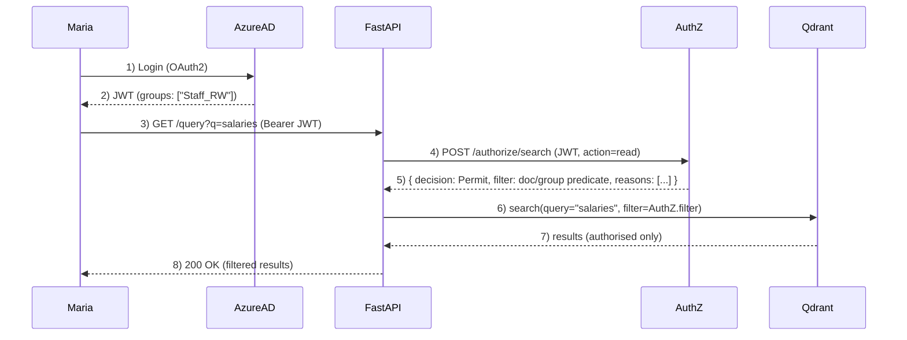

# Homelab Retrieval-Augmented Generation (RAG)

A Retrieval-Augmented Generation (RAG) homelab designed to ingest, embed, and query enterprise-scale corpora — over 100,000 research papers today, with new content added weekly. 

👉 **Note**: This repo is a shop window.  
The actual working codebase is private, as this is first and foremost a *learning tool*. When components are production-ready, they’ll be released here or as separate open-source modules.

Retrieval-Augmented Generation (RAG) systems ground a large language model's responses in a specific, authoritative knowledge base. This system has consumed over 100,000 AI research papers. Each paper is broken into smaller sections ("chunks") and each of these is processed into an embedding, a mathematical representation that makes it possible to compare concepts and ideas rather than just matching keywords.

When a question is asked, it too is converted into embeddings. The system matches these embeddings against the stored research and provides the results to the language model. The model then uses the retrieved content, along with style and instruction prompts, to generate a natural-language answer that stays grounded in the source material.

## Project goals
1. Hands-on learning: Build a non-trivial Linux software project, gaining practical experience with Python, PyTorch, Bash, GitHub, monitoring, Kubernetes and related tooling. 
2. Deep dive into RAG and AI: Explore the architecture, components, best practices, and evaluation of retrieval-augmented generation systems.
3. User experience and prompt engineering: Design intuitive interfaces and effective, measurable prompts.
4. Tuning and re-ranking: Train and evaluate lightweight ML models (e.g. cross-encoders, rerankers) to improve retrieval quality and prepare for GPU-accelerated fine-tuning.

## Current Status: 31 August 2025  
**Version 0.1**

### What’s live
- Embedding 112,660 AI research papers from OpenAlex into PostgreSQL + Qdrant  
- Ingestion, storage, and retrieval services fully wired together with a basic UI

### Milestone closed
Two-month sprint focused on building the core system: plumbing, pipelines, and reliability.

### Q4 2025 Sprint
#### 1. Reranking microservice (PyTorch cross-encoder)
- Build and deploy the reranking service to improve retrieval quality.
#### 2. Kubernetes rebuild with Terraform + Ansible
- Move the lab from single snowflake servers to enterprise-ready Infrastructure as Code.  
- Deploy k3s control plane + first worker node.  
- Begin gradual migration of RAG services into containers.
#### 3. Multi-corpus architecture (AI + Classics)
- Maintain AI corpus as the primary index.  
- Plan parallel Classics corpus (Ancient Greek history, philosophy, literature) with separate ingestion, embeddings, and endpoints.  
- Establish governance and monitoring to keep corpora independent but extensible.

## Roadmap 2025–2026

I am working on two parallel tracks:  
- **Application Layer**: user-facing features and AI components  
- **Infrastructure Layer**: systems engineering, deployment, and reliability
  
| Quarter | Application Layer (AI / Features)                                     | Infrastructure Layer (Systems / Ops)              |
|---------|-----------------------------------------------------------------------|---------------------------------------------------|
| Q4 2025 | ▸ Re-ranking microservice (PyTorch cross-encoder) ▸ Implement parallel Classics corpus                      | Stabilisation + Kubernetes/Terraform/Ansible refactor |
| Q1 2026 | ▸ SharePoint ACL enforcement (event-driven, Graph API)                | Security services (threat modelling, PII redaction, audit logging) |
| Q2 2026 | ▸ Metrics dashboards + golden set                                     | CI/CD hardening + experiment tracking             |
| Q3 2026 | ▸ Domain LLM fine-tuning (LoRA/adapters)                              | Artefact versioning + lineage tracking            |
| Q4 2026 | ▸ UI & prompt libraries (with citations)                              | RAG-specific observability + drift/shadow deploys |

## Security & Governance

Although this project runs in a homelab, security is not an afterthought. It is treated as a first-class concern, with a dedicated security VM (`lab-1-security01`) that centralises services such as threat modelling, pentesting experiments, PII redaction, and audit logging.  

If a wrongly-secured document enters the system, the design must allow:  
- **Complete remediation**: rapid removal from all layers — blob storage, metadata database, and vector index.  
- **Exposure tracking**: identification and logging of all access (which users, which queries, which results and when) to provide an auditable record of any exposure window.

## Project Structure  

Each functional stage of the pipeline has:  
- a **folder** in the repository (code & configs)  
- a **dedicated VM** (runtime environment)  

The lab now spans 12 dedicated VMs — 11 Ubuntu and one Windows 11 — each mapped 1:1 to a functional stage of the system.  
This separation enforces clear boundaries, supports safer experimentation, and mirrors enterprise design patterns.

| VM Name              | Repo Folder | Description |
|----------------------|-------------|-------------|
| lab-1-mgmt01         | Management  | Management & orchestration |
| lab-1-db01           | Database    | Metadata (PostgreSQL) + Vector DB (Qdrant) |
| lab-1-embed01        | Embed       | Embedding Service (currently: nomic-embed-text-v1) |
| lab-1-ingestion01    | Ingestion   | Data ingestion (SharePoint + OpenAlex pipelines) |
| lab-1-ui01           | UI          | UI layer (Prototyping: Streamlit; Prod: React + TypeScript) |
| lab-1-retrieval01    | Retrieval   | FastAPI retrieval microservice + LangChain orchestration |
| lab-1-storage01      | Storage     | Object storage (MinIO) |
| lab-1-monitoring01   | Monitoring  | Monitoring & Logging (Prometheus, Grafana, etc.) |
| lab-1-tuning01       | Tuning      | Experimental VM for training/fine-tuning |
| lab-1-reranker01     | Reranker    | PyTorch-based re-ranking microservice |
| lab-1-security01     | Security    | Lab security services: threat modelling, audit logging, etc |
| lab-1-win01      | Integration     | Windows 11 VM for developing and testing the Azure/SharePoint ACL integration app |

## RAG lab infrastructure

Hosted on a Minisforum UM890 Pro running Proxmox  
- Ryzen 9 8945HS  
- 64 GB DDR5 RAM  
- 2 TB NVMe  

This is supplemented by:  
- AWS EC2 GPU instances for embeddings and reranking.  
- OpenAI APIs (ChatGPT) for response generation.  

The lab operates in three modes — general usage, embedding, and fine-tuning — to optimise use of limited local hardware resources.
## CI/CD overview

A branch-based promotion pipeline is in place with two environments per service, orchestrated by GitHub Actions.

- dev → staging: every push/merge to dev triggers a workflow that builds, runs tests, and deploys to staging on the target VM.  
- main → production: merging dev into main triggers a workflow that deploys to production, optionally gated by manual approval.  

Endpoints expose /health and /version for post-deploy checks.

## SharePoint Online security integration (Q1 2026)

Goal: propagate SharePoint permission changes to search results within ~5 seconds, end-to-end. The system must enforce access at every layer (API, vector search, and object storage) without adding noticeable latency.

### Architecture sketch

- Source of truth
  - SharePoint site/file ACLs and Azure AD groups/roles (via Microsoft Graph).
- Event-driven sync (push, not pull)
  - Graph change notifications → Event Grid → Azure Function → AuthZ `/acl/update`.
  - AuthZ normalises ACL deltas, updates its Redis cache, and persists a compact audit trail.
- Authorisation boundary
  - A C#/.NET AuthZ microservice validates JWTs, resolves group membership, evaluates policies (RBAC/ABAC), and returns either a Permit/Deny or a Qdrant-ready filter.
- Retrieval enforcement
  - Points in Qdrant are tagged at index time (e.g. `allowed_groups`, `doc_id`, `tenant_id`, optional `doc_acl_hash`).
  - Retrieval service applies the filter returned by AuthZ; results are authorised by construction.
- Object storage enforcement (defence in depth)
  - MinIO hardened with TLS, SSE-S3, and bucket policies.
  - Blob access via short-lived pre-signed URLs issued only after an `AuthZ /authorize/object` Permit.

### User-centric flow

Auth: Maria signs in; her Azure AD groups (e.g. `Staff_RW`) are in the JWT.

Enforcement: FastAPI asks AuthZ *“what is Maria allowed to see for this query?”* AuthZ returns a decision and a filter; FastAPI forwards the filter to Qdrant. Even if the term “salaries” hits restricted documents, those points are excluded by the filter.

### Sequence  

## Disaster Recovery & Continuity

This lab runs on limited hardware; there is no hot failover. The design focuses on **resilience and recoverability**, applying continuity patterns that would scale in an enterprise context.

- **Kubernetes self-healing**: liveness/readiness probes, rolling updates, pod restarts. (work-in-progress)  
- **Immutable infra**: full rebuild via IaC (Terraform/Ansible/K8s manifests). (work-in-progress) 
- **Backups**: PostgreSQL, Qdrant, and MinIO replicated off-box with regular restore tests.  
- **Cold standby**: documented procedure to recover a new node from snapshots.  
- **Degraded modes**: fallbacks if reranker, embedding, or LLM services are offline. (work-in-progress)  

## Documentation

Additional background and design notes will live in the [`documentation/`](documentation) folder:

- [DNS Setup](documentation/dns-setup.md)

