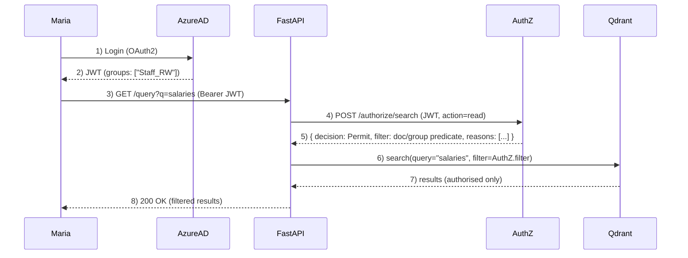

# Homelab Retrieval-Augmented Generation (RAG)

A Retrieval-Augmented Generation (RAG) homelab designed to ingest, embed, and query enterprise-scale corpora — over 100,000 research papers today, with new content added weekly.

👉 **Note**: This repo is a **shop window**.  
The actual working codebase is private, as this is first and foremost a *learning tool*. When components are production-ready, they’ll be released here or as separate open-source modules.

Retrieval-Augmented Generation (RAG) systems ground a large language model's responses in a specific, authoritative knowledge base. This system has consumed over 100,000 AI research papers. Each paper is broken into smaller sections ("chunks") and each of these is processed into an embedding, a mathematical representation that makes it possible to compare concepts and ideas rather than just matching keywords.

When a question is asked, it too is converted into embeddings. The system matches these embeddings against the stored research and provides the results to the language model. The model then uses the retrieved content, along with style and instruction prompts, to generate a natural-language answer that stays grounded in the source material.

## Project goals
1. Hands-on learning: Build a non-trivial Linux software project, gaining practical experience with Python, PyTorch, Bash, GitHub, monitoring, and related tooling. 
2. Deep dive into RAG and AI: Explore the architecture, components, best practices, and evaluation of retrieval-augmented generation systems.
3. User experience and prompt engineering: Design intuitive interfaces and effective, measurable prompts.
4. Tuning and re-ranking: Train and evaluate lightweight ML models (e.g. cross-encoders, rerankers) to improve retrieval quality and prepare for GPU-accelerated fine-tuning.
5. Security and governance as first-class citizens: Operate a dedicated security VM (`lab-1-security01`) to centralise services such as threat modelling, pentesting, PII redaction, audit logging, and compliance tooling.
6. Practical research assistant: Maintain a weekly-updated repository of the latest AI research, enriched through the RAG pipeline and queried via LLMs.

## Current Status: 31 August 2025  

**Version 0.1**  
The core system is up and running. It is currently embedding 112,660 AI research papers from OpenAlex into PostgreSQL + Qdrant, with ingestion, storage, and retrieval services fully wired together.  

This milestone closes a two-month sprint focused on plumbing and reliability: ingestion pipelines, CI/CD, monitoring, and a first working UI.  

Upcoming phases will build on this base with re-ranking, SharePoint ACL integration, and evaluation dashboards.

**Next up:** bring reranker01 online (PyTorch + cross-encoder) to improve result ordering and lay the groundwork for fine-tuning.  

## Roadmap 2025–2026

I am working on two parallel tracks:  
- **Application Layer**: user-facing features and AI components  
- **Infrastructure Layer**: systems engineering, deployment, and reliability
  
| Quarter | Application Layer (AI / Features)                                     | Infrastructure Layer (Systems / Ops)              |
|---------|-----------------------------------------------------------------------|---------------------------------------------------|
| Q4 2025 | Re-ranking microservice (PyTorch cross-encoder)                       | Stabilisation + Kubernetes/Terraform refactor     |
| Q1 2026 | SharePoint ACL enforcement (event-driven, Graph API)|Security services (threat modelling, PII redaction, audit logging) |
| Q2 2026 | Metrics dashboards + golden set                                       | CI/CD hardening + experiment tracking             |
| Q3 2026 | Domain LLM fine-tuning (LoRA/adapters)                                | Artefact versioning + lineage tracking            |
| Q4 2026 | UI & prompt libraries (with citations)                                | RAG-specific observability + drift/shadow deploys |

## Security & Governance

Although this project runs in a homelab, security is not an afterthought. It is treated as a first-class concern, with a dedicated security VM (`lab-1-security01`) that centralises services such as threat modelling, pentesting experiments, PII redaction, and audit logging.  

If a wrongly-secured document enters the system, the design must allow:  
- **Complete remediation**: rapid removal from all layers — blob storage, metadata database, and vector index.  
- **Exposure tracking**: identification and logging of all access (which users, which queries, which results and when) to provide an auditable record of any exposure window.

## Current ingestion and embedding status
- PDFs in MinIO object storage: 112660  
- JSON metadata in PostgreSQL: 112660  
- Distinct chunked papers: 112660  
- Papers with any chunk embedded: 41170  
- Fully embedded papers (ALL chunks): 41170
- Any-embed progress: 41170/112660 (36.54%) — Remaining (any): 71490
- Full-embed progress: 41170/112660 (36.54%) — Remaining (full): 71490
  
  30 August 2025 15:38:21

## Project Structure  

Each functional stage of the pipeline has:  
- a **folder** in the repository (code & configs)  
- a **dedicated VM** (runtime environment)  

The lab now spans 11 dedicated VMs, each mapped 1:1 to a functional stage of the system. This separation enforces clear boundaries, makes experimentation safer, and mirrors enterprise design patterns.

| Repo Folder | VM Name            | Description                                                                 |
|-------------|--------------------|-----------------------------------------------------------------------------|
| Management  | lab-1-mgmt01       | Management & orchestration (Terraform, Ansible, backups)                    |
| Database    | lab-1-db01         | Metadata (PostgreSQL) + Vector DB (Qdrant)                                  |
| Embed       | lab-1-embed01      | Embedding Service (currently: nomic-embed-text-v1)                          |
| Ingestion   | lab-1-ingestion01  | Data ingestion (SharePoint + OpenAlex pipelines)                            |
| UI          | lab-1-ui01         | UI layer (Prototyping: Streamlit; Prod: React + TypeScript)                 |
| Retrieval   | lab-1-retrieval01  | FastAPI retrieval microservice + LangChain orchestration                    |
| Storage     | lab-1-storage01    | Object storage (MinIO)                                                      |
| Monitoring  | lab-1-monitoring01 | Monitoring & Logging (Prometheus, Grafana, Alertmanager, Filebeat → Elasticsearch) |
| Tuning      | lab-1-tuning01     | Experimental VM for training and fine-tuning models, evaluation workflows, and ML prototyping |
| Reranker    | lab-1-reranker01   | PyTorch-based re-ranking model. Dedicated microservice for re-ranking retrieved results using cross-encoder models (e.g., DistilBERT, monoT5) to improve answer relevance. |
| Security    | lab-1-security01   | Centralised security services: threat modelling, pentesting, PII redaction, audit logging, and compliance tooling. |

## RAG lab infrastructure

Hosted on a Minisforum UM890 Pro running Proxmox  
- Ryzen 9 8945HS  
- 64 GB DDR5 RAM  
- 2 TB NVMe

The lab operates in three modes — general usage, embedding, and fine-tuning — to optimise use of limited hardware resources.

## CI/CD overview

A branch-based promotion pipeline is in place with two environments per service, orchestrated by GitHub Actions.

- dev → staging: every push/merge to dev triggers a workflow that builds, runs tests, and deploys to staging on the target VM.  
- main → production: merging dev into main triggers a workflow that deploys to production, optionally gated by manual approval.  

Endpoints expose /health and /version for post-deploy checks.

## SharePoint Online security integration (Q1 2026)

Goal: propagate SharePoint permission changes to search results within ~5 seconds, end-to-end. The system must enforce access at every layer (API, vector search, and object storage) without adding noticeable latency.

### Architecture sketch

- Source of truth
  - SharePoint site/file ACLs and Azure AD groups/roles (via Microsoft Graph).
- Event-driven sync (push, not pull)
  - Graph change notifications → Event Grid → Azure Function → AuthZ `/acl/update`.
  - AuthZ normalises ACL deltas, updates its Redis cache, and persists a compact audit trail.
- Authorisation boundary
  - A C#/.NET AuthZ microservice validates JWTs, resolves group membership, evaluates policies (RBAC/ABAC), and returns either a Permit/Deny or a Qdrant-ready filter.
- Retrieval enforcement
  - Points in Qdrant are tagged at index time (e.g. `allowed_groups`, `doc_id`, `tenant_id`, optional `doc_acl_hash`).
  - Retrieval service applies the filter returned by AuthZ; results are authorised by construction.
- Object storage enforcement (defence in depth)
  - MinIO hardened with TLS, SSE-S3, and bucket policies.
  - Blob access via short-lived pre-signed URLs issued only after an `AuthZ /authorize/object` Permit.

### User-centric flow

Auth: Maria signs in; her Azure AD groups (e.g. `Staff_RW`) are in the JWT.

Enforcement: FastAPI asks AuthZ *“what is Maria allowed to see for this query?”* AuthZ returns a decision and a filter; FastAPI forwards the filter to Qdrant. Even if the term “salaries” hits restricted documents, those points are excluded by the filter.

### Sequence  

## Disaster Recovery & Continuity

This home lab runs on limited hardware; there is no hot failover. The design aims for simple resilience: fast self-healing for process failures and documented recovery for host failures. The goal is not five-nines uptime, but to learn and demonstrate continuity patterns that would scale in an enterprise context.

What Kubernetes covers (work-in-progress)
- **Self-healing**: liveness/readiness probes, pod restarts, rolling deploys.
- **Graceful updates**: zero-(ish) downtime rollouts with rollback.
- **Resource hygiene**: requests/limits to avoid noisy-neighbour crashes; PodDisruptionBudgets for safer restarts.

What it does **not** cover here
- **Single-host risk**: if the Proxmox node dies, the cluster is down.
- **GPU scarcity**: training jobs queue; no transparent GPU failover.

Continuity strategy (practical, on this hardware)
- **Immutable infra**: full rebuild via IaC (Terraform/Ansible/K8s manifests). Target: clean cluster redeploy < 2 hours. (work-in-progress)
- **Backups**
  - PostgreSQL: nightly base backup + WAL archiving (pgBackRest/pg_dump + cron) to external storage.
  - Qdrant: scheduled snapshots of collections (and metadata) off-box.
  - MinIO: bucket versioning + daily replication/sync to external storage (e.g., NAS or cloud bucket).
  - **Verification**: automated restore test of each tier weekly (smoke), full end-to-end restore monthly.
- **Cold standby**: documented procedure to spin up a new node from snapshots; not automated, but rehearsed.
- **Provenance & audit**: query/result logs centralised; exposure reports possible even after restore.
- **Secrets management**: encrypted at rest (e.g., SOPS + age or Vault); rotation playbook included.
- **Degraded modes** (work-in-progress)
  - If reranker is down → fall back to base vector search.
  - If embeddings are down → serve from cache; queue new queries for later embed.
  - If LLM is unreachable → return retrieved citations with “no synthesis” banner.

Targets (lab-scale)
- **RPO (data loss window)**: ≤ 24h for general data; ≤ 1h for Postgres via WAL.
- **RTO (restore time)**: ≤ 4h for read-only retrieval; ≤ 8h full service (including reranker/LLM).
- **SLOs (best-effort)**: P95 query latency < 1.5s; P99 < 3s under normal load.

Operational hygiene
- Runbooks: printable step-by-step for backup/restore and “host down” scenarios.
- Fire drills: quarterly simulate loss of a service and a host; record actual RPO/RTO.
- Observability: per-step latency (embed → retrieve → rerank → generate), error rates, and queue depths on dashboards.

Limitations (explicit)
- No multi-node HA; a host failure is a downtime event.
- No cross-region DR; off-site copies mitigate loss, not instant failover.

